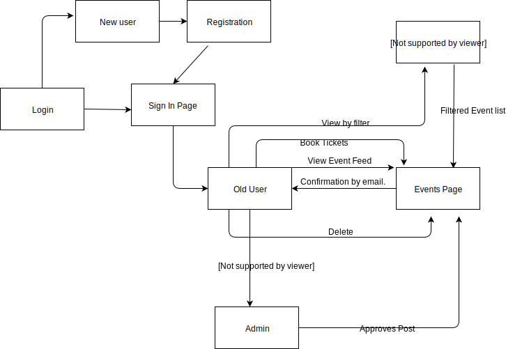

# Final-Project-web_developers
The purpose of the website application is to create a platform where events going around the area can be shared and social gatherings are improved.
So basically the website manages to do the following things :

* As a user, I should be able to register my new account
* As a user, I should be able to login into my account
* As a user, I should be able to view events 
* As a user, I should be able to book events
* As a user, I should get mail of the booked event
* As a user, I should be able create a new event
* As a user, I should be able to update event details, so that correct details can be available to other users.
* As a user, I should be able to delete an event, so that outdated events should not available to other users
* As a user, I should be able to view my respective events in my profile
* As a user, I should be able to logout from my account
* As a user, I should get all details related to my booked event in mail

Prerequisites : 

* Nodejs 8.12.0
* MongoDB
* Mongoose 5.3.13
* angular/cli: 7.0.6
* Expressjs 4.16.4
* Bootstrap 4.1.3

Steps to run the application:

Step 1. : Start the Mongodb server using command "mongod" on command prompt

Step 2. : Start the nodejs server using commands after opening terminal for backend :
        * npm install 
        * npm run dev 
        
Step 3. : Once the nodejs and mongodb server is running run the following commands on frontend :
        * npm install
        * ng serve
        
Step 4. : open localhost:4200, the homepage will be displayed

Reference : https://github.com/amuthanarulraj/sticky-server
Reference : https://angular.io/

